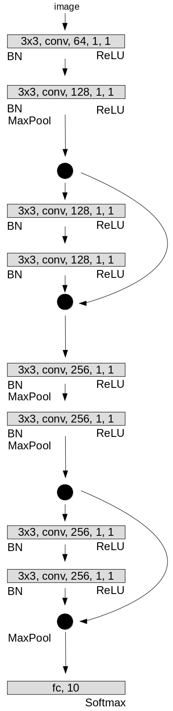
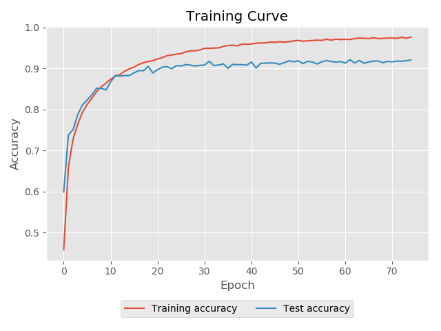

# PyTorch ResNet9 for CIFAR-10

I implemented the architecture described in [this](https://myrtle.ai/learn/how-to-train-your-resnet-4-architecture/) blog post. It is a 9-layer ResNet (He et al. 2015) for image classification on [CIFAR-10](https://www.cs.toronto.edu/~kriz/cifar.html) (Krizhevsky 2009).

## Dependencies
* [Python (Anaconda 3.6.5)](https://anaconda.org/)
* [PyTorch (1.0.0)](https://pytorch.org/) 
* [NumPy (1.15.4)](http://www.numpy.org/) 
* [PIL (1.1.7)](https://pillow.readthedocs.io/en/stable/)


## Usage

### Training

```python
from resnet import ResNet

net = ResNet()
net.train(save_dir='saves', num_epochs=75, batch_size=256, learning_rate=0.001, verbose=True)
accuracy = net.test()
print('Test accuracy: {}'.format(accuracy))
```

### Load pretrained weights

```python
from resnet import ResNet

net = ResNet()
net.load_parameters(path='saves/resnet__epoch_75.pth')
accuracy = net.test()
print('Test accuracy: {}'.format(accuracy))
```

## Architecture

<p align="center">
  
</p>

## Training

|     Hyperparameter     |    Value   |
|          :---:         |    :---:   |  
|    Number of Epochs    |     75     |
|      Batch Size        |     256    |
|     Learning Rate      |    0.001   |
|   Weight Decay (Adam)  |    1e-5    |


<p align="center">
  
</p>

## Results

| Training accuracy | Test accuracy |
|       :---:       |     :---:     |
|      97.64 %      |    92.05 %    |

## References
Kaiming H, Zhang X, Ren S, and Sun J. (2016). Deep Residual Learning for Image Recognition. Conference on Computer Vision and Pattern Recognition (CVPR).

Krizhevsky A. (2009). Learning multiple layers of features from tiny images. Technical Report.

## License
This project is licensed under the [MIT Licence](https://choosealicense.com/licenses/mit/)
